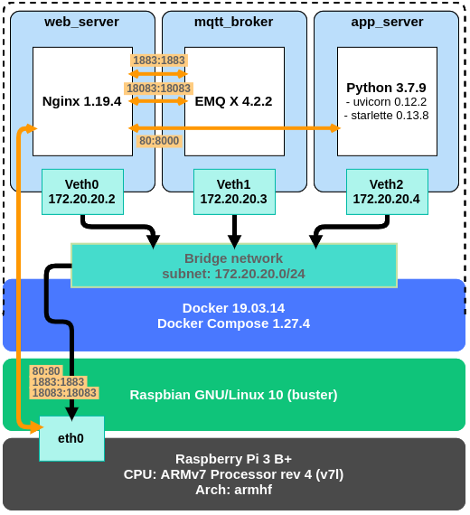

# leak_monitoring_app



## Environment
Machine:
- Laptop
  - CPU: Intel(R) Core(TM) i7-8665U CPU @ 1.90GHz 
  - Arch: amd64
  - OS: Ubuntu 18.04.5 LTS (Bionic Beaver)
- Raspberry Pi 3 B+
  - CPU: ARMv7 Processor rev 4 (v7l)
  - Arch: armhf
  - OS: Raspbian GNU/Linux 10 (buster)

System:
- Docker: 19.03.14
- Docker Compose: 1.27.4

In containers:
- Python: 3.7.9
- Nginx: 1.19.4
- EMQ X Broker: 4.2.2

## EMQ X Broker

|Port|Description|
|:-:|:-:|
|1883|MQTT/TCP protocol port|
|11883|MQTT/TCP Protocol internal port, only used for local client connection|
|8883|MQTT/SSL protocol port|
|8083|MQTT/WS protocol port|
|8084|MQTT/WSS protocol port|
|18083|EMQ X Dashboard (emqx_dashboard)|
|8081|HTTP API (emqx_management)|

## Python dependency management
Poetry version 1.1.4

## Firewall managemanet
Using UFW (Uncomplicated Firewall) to configure iptables.

Install UFW if it doesn't exist on system. 
```
sudo apt install ufw
```

Startup UFW:
```
sudo ufw enable
```

Export application profile of UFW for this project, then copy to `/etc/ufw/applications.d` (require `root` permission).
```
make exports-ufw-profile
```

Apply application profile to UFW:
```
sudo ufw allow ndlm_leak_monitoring_app
```

Show firewall status:
```
sudo ufw status verbose
```

Firewall status:
```
狀態: 啓用
日誌: on (low)
Default: deny (incoming), allow (outgoing), deny (routed)
新建設定檔案: skip

至                          動作          來自
-                          --          --
80,443,1883,8883/tcp (ndlm_leak_monitoring_app) ALLOW IN    Anywhere                  
80,443,1883,8883/tcp (ndlm_leak_monitoring_app (v6)) ALLOW IN    Anywhere (v6)
```

## Env files for Docker Compose
You need to create  Env files manually in `docker/env` folder. See example contents in `docker/env_example`.

## Deploy as systemd service on  Raspberry Pi
We create the systemd service template for Docker compose, see `config/systemd/docker-compose@.service`.

To deploy application as systemd service, execute the follow command first:
```
make deploy-systemd-service
```
It will build Docker images and copy `docker-compose.yml` & Env files to `/etc/docker/compose/ndlm_leak_monitoring_app`

Then start `docker-compose@ndlm_leak_monitoring_app. service`& enable it to start on boot.
```
make systemctl-start
make systemctl-enable
```
The service requires `docker.service`, please check `docker.service` is to start on boot.
